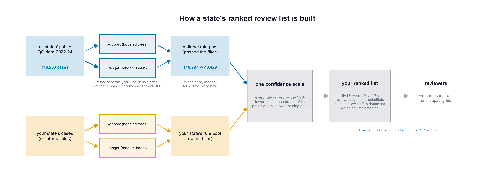

# snap_qc

Code and data for modeling SNAP payment errors as interpretable, easy-to-implement decision rules.

Released under the Apache 2.0 license: use and build on the code, ideas, or results freely.

**[Updates & compatibility](VERSIONING.md)** · **[Guidance from validation studies](GUIDANCE.md)** · **[Data dictionary](DATA_DICTIONARY.md)** · **[Changelog](CHANGELOG.md)**

## Updates and compatibility

See [VERSIONING.md](VERSIONING.md): tagged releases, plain-language change summaries in [CHANGELOG.md](CHANGELOG.md), deprecation before removal, and superseded outputs archived rather than deleted. If you build a process on this code, pin a release tag and read the changelog before updating.

---

## Two versions of this pipeline

**v2 (recommended, below)** mines rules with gradient-boosted trees (xgboost) plus a random forest (ranger), and filters each rule on a statistical lower bound on its precision (precision = the share of flagged cases that truly have an error). It replaces the earlier RuleFit/{pre}-based pipeline.

**v1 (preserved, [further down](#v1-documentation-legacy))** is the original {pre}-based pipeline. Everything v1 still works and its documentation is kept intact below. If you have invested in v1, nothing you built is broken or removed. New projects should start with v2.

**Why v2 exists.** Shortlisting mined rules by their raw training precision suffers a strong winner's curse: a rule looks best partly because it got lucky, so a list built to hit 20% precision delivered only ~10% on data it hadn't seen. v2 filters on the **lower confidence bound (Wilson LCB)** of each rule's training precision instead. A rule that clears a 20% filter now delivers about 20% on hold-out data (data set aside and never used to build or pick the rules).

The rebuild paid off in other ways. The pipeline runs several times faster (v1 mined one error-type dataset in about 40 minutes; v2 mines all four typed datasets plus the pooled all-errors model in about 45) and fits on a 16 GB laptop, where v1's internal lasso needed 40+ GB at scale. It scores every rule against **all** error types, so a rule mined for earned-income errors still gets credit when the case it flags turns out to have a deduction error, which is what happens in deployment. And it mines the largest error category v1 left out, `other_error`, which is mostly **deductions**. The engine change alone catches 55% of error dollars at the 0.20 filter floor versus 47% for the CART-based generator {pre} used. That is about eight more points of error-dollar recall (the share of all error dollars caught), at slightly higher precision. The [guidance section](#guidance-from-the-validation-studies) summarizes these results; [`methods/modeling_findings.md`](methods/modeling_findings.md) gives them in full.

---

# v2 documentation (recommended)

## Requirements

**Software.** R (developed on 4.5.1) and four packages (no `{pre}` needed):

```r
install.packages(c("dplyr", "ggplot2", "ranger", "xgboost"))
# add "rpart" only if you want the optional bagged-CART engine
```

**Data.** Bring a data frame with one row per case, a column flagging whether the case is a true error, and your features; or build the national public-QC frame with `1_data_munging_and_raw_variable_reconstruction_for_using_public_qc_data.R` (details under [Where to start](#where-to-start)).

**Running a script, two ways.** Open it in R/RStudio and source it after editing the config block at the top, or run it non-interactively through its runner (which loads `reg_model_data.rds` and sources the driver). For example, to build the delivery lists:

```
Rscript runners/run_blended_delivery_batch.R > blended_delivery_run.log 2>&1
```

## Where to start

**The best-validated approach in this repo is the blended delivery list**, built by `INCL_build_blended_delivery_list_v2.R`: one frozen, ranked rule list per state. It works in three steps:

1. **Admit rules.** Each rule pool keeps only rules that both statistically beat the base error rate (a false-discovery-rate test) *and* flag at least 30 training cases, so poorly-measured rules stay out of the ranking (details in the folder README).
2. **Rank on one scale.** The state's own rules are merged into the national pool, and every rule is ranked by the 99% lower bound of its own training precision, so state and national rules compete on comparable, confidence-discounted evidence.
3. **Fill to budget.** The list is filled against the state's caseload to a 5% or 10% review budget (the *core*) and extended with ranked *buffer* rules out to 3x that depth. The state activates rules in rank order until review capacity fills, with no outcome data needed at any step.

Tested a full year ahead of the training data (mined on 2022-23, scored on each state's 2024), this recipe beat the national-only list at the 5% budget (median precision 0.324 vs 0.294, catching 15% vs 12% of error dollars), came out about even at 10% (0.262 vs 0.270), and cleared every one of 18 states' base error rate (national ~11%, a 1.5-3.4x lift over reviewing at random). Ready-built lists are in [`state_delivery_lists/`](state_delivery_lists/).



A state can also run the same script as a hybrid. It mines its own pool from internal case files (which include the ineligible determinations the public files leave out) and blends that with the pool mined from other states' public QC data. The confidence-bound scale is what makes rules from the two sources directly comparable, so nothing else in the recipe changes.

Two alternate routes, depending on your use case:

**I have a pile of cases already flagged for review and want to cut it down** → `EXCL_find_exclusion_rules_by_hh_size_v2.R` is the mirror image, built with the same machinery: instead of flagging likely errors, it finds rules for cases that are very likely error-free (scored on the clean rate with the same confidence bound), so you can drop those low-risk cases and shrink the pile while keeping nearly all of its error dollars.

**I don't have a flagging system and want to identify which cases are most likely to have an error** → `INCL_build_blended_delivery_list_v2.R` builds the blended delivery list described above and is self-contained: it mines the national and state rule pools itself. 

If you only want to use internal data, use `INCL_find_inclusion_rules_by_hh_size_v2.R` since it does not expect the national data as an input. You can also use `INCL_find_inclusion_rules_by_hh_size_v2.R` when you want the full exploration outputs instead: rules mined per error type as well as pooled, filtered shortlists, and the filter-floor sweep curves (see `state_delivery_lists/README.md` for the delivery lists' column definitions and caveats). 

If you want to keep it very simple, start from the rule lists for your state in `state_delivery_lists/`. Note that per-state threshold tuning (`state_threshold_gridsearch_v2.R`) remains available, but in an 18-state future-year test it did not beat deploying the national ranking as-is for the median state, so treat tuning as a fallback and validate it on your own hold-out year first.

The scripts expect a data frame with one row per case, a column indicating whether the case is a true error, and your features. Update the config block at the top of the script: the `features` vector and `TARGET_IS_ERROR` expression are the main things to change. Features must be numeric, logical, or two-level factors (multi-level factors are rejected with a clear message, so recode upstream). See [the data dictionary](DATA_DICTIONARY.md) for the default feature set.

To use the national public QC data, build `reg_model_data` with `1_data_munging_and_raw_variable_reconstruction_for_using_public_qc_data.R` (unchanged from v1).

## How v2 works

Every driver runs the same five-stage pipeline, implemented once in **`rule_mining_helpers.R`**:

```
generate  ->  canonicalize  ->  dedup  ->  evaluate  ->  sweep / shortlist
```

1. **Generate.** Two tree ensembles per mining frame and household-size stratum (1 / 2-3 / 4+): xgboost (1,000 rounds, eta .02, subsample .20) and ranger (1,000 trees, mtry 2). The inclusion driver mines five frames: one per error type (earned, unearned, underissuance, other) **plus a pooled all-errors frame**, since the typed and pooled vocabularies catch complementary rules. Every node's root-to-node path becomes a candidate rule; the engines are likewise complementary, so unions beat any single source.
2. **Canonicalize.** Thresholds rounded to 3 significant digits, redundant bounds collapsed, conditions put in a canonical order.
3. **Dedup** in three layers: exact text, exact coverage (two rules flagging identical cases collapse to the simpler one), and same-structure dominance (a rule is dropped only when a looser rule with an equal-or-better statistic provably contains it). Overlapping rules with *different* structure are deliberately kept, so agencies can drop any rule on expert judgment and keep others that catch the same errors.
4. **Evaluate.** Each rule's flags are computed on training data, a hold-out year, and the full **any-error universe** (all error types). Frame-relative precision understates deployed precision roughly 2x; both are reported.
5. **Filter and sweep.** Rules are filtered at the one-sided 99% Wilson lower bound of train precision (`LCB_Z = 2.326`). The sweep reports, for each filter floor, the union's hold-out precision, recall, and dollar recall; an error caught by several rules counts once, so redundancy never overstates recall. There are no greedy "nets" in v2, and the filtered rule list plus the sweep replaces them.

The approach to ensemble size: mine a large candidate pool, then filter it strictly. Large ensembles reach more of the errors; the strict confidence bounds remove the extra selection noise that more candidates would otherwise inject.

## Statistics and goal metrics

The five-stage machinery is general purpose: for every rule it produces honest evidence, namely support, precision, confidence bounds, and provenance. What to *optimize* is a separate, user-chosen module: a **ranking statistic** paired with the **goal metric** it is judged by. Different goals need different statistics (a statistic that wins at one goal can lose at another, and we measured exactly that), so delivered files carry their pairing in the filename, and a new pairing is adopted only after it passes the same held-out-year validation as everything else.

| your goal | statistic | where | status |
|---|---|---|---|
| find errors at a fixed review workload | 99% Wilson lower bound of any-error precision (`lcb99_workloadfill`) | `INCL_build_blended_delivery_list_v2.R` → `state_delivery_lists/` | validated twice with hold-out testing on 2019 (train 2017-18) and 2024 (train 2022-23), 18 states (see [`modeling_findings.md`](methods/modeling_findings.md) §20) |
| cut an existing review pile safely | 95% lower bound of the clean rate among dropped cases | `EXCL_find_exclusion_rules_by_hh_size_v2.R` | reported on a held-out year (2023): a workload-cut vs error-dollar-retention curve (e.g. drop the safest ~17% of the pile and keep ~96% of its error dollars) under a relative safety standard (excluded cases at least 5x safer than the pile average); not yet multi-era or multi-state validated (see [`modeling_findings.md`](methods/modeling_findings.md) §23) |
| prioritize error dollars | dollars per flagged case (plus a heavy-tail-robust variant) | `methods/dollaryield_audition_v2.R` | an option you can use, though not the default: it ranks by error dollars per flagged case, and was only modestly better at error-dollar recall than `lcb99_workloadfill` (+3.5pp at the 10% budget on 2024, +1.0pp on the 2019 replication), below the pre-set 2-point adoption bar (see [`modeling_findings.md`](methods/modeling_findings.md) §21) |

## v2 scripts

| script | purpose |
|---|---|
| `rule_mining_helpers.R` | all shared logic (the five stages) |
| `test_rule_mining_helpers.R` | 26-check regression test on synthetic data; run after touching the helpers |
| `INCL_find_inclusion_rules_by_hh_size_v2.R` | inclusion rules per mining frame (earned, unearned, underissuance, other, + pooled all-errors) x household size |
| `EXCL_find_exclusion_rules_by_hh_size_v2.R` | exclusion rules: filter safe-to-skip cases by clean-rate LCB; reports workload cut vs error-dollar retention |
| `state_threshold_gridsearch_v2.R` | tunes national rule thresholds per state and tests on a hold-out year, incl. a "deploy national as-is" benchmark |
| `INCL_build_blended_delivery_list_v2.R` (+ `runners/run_blended_delivery_batch.R`) | builds a state's deployable ranked list: blends the state's own mined rules into the national pool on the confidence-bound scale, sized to a review budget with buffer rules |
| `methods/deployment_benchmark_train2223_test24.R`, `methods/frozen_list_experiment_v2.R`, `methods/blended_frozen_lists_v2.R` | the deployment studies behind the delivery recipe (train 2022-23, test 2024, 18 states) |
| `methods/tune_engine_params_v2.R` | one-at-a-time engine hyperparameter sweeps, judged by hold-out frontier |
| `compare_*_v2.R` | the studies behind the design choices (engines, engine pairs, typed-vs-pooled mining, HH strata) |
| `run_*.R` | non-interactive runners (load `reg_model_data.rds`, source the script) |

Outputs: `inclusion_rules_by_hh_size_v2/` (per-frame rule CSVs with train/hold-out/any-error stats, filtered shortlists, sweep curves), `exclusion_rules_by_hh_size_v2/`, and `state_delivery_lists/` (the deployment deliverable). The superseded per-state threshold-tuning outputs live in `archive/state_rules_v2/`.

## Key settings (v2)

| setting | default | meaning |
|---|---|---|
| `LCB_Z` | 2.326 (99%) | filter stringency; use 1.2816 (90%) for exploration |
| `THRESHOLD_GRID` | .05-.95 | filter floors reported by the sweep |
| `MIN_TRAIN_FLAGGED` | 10 | minimum flagged training cases per rule (a backstop; the lower bound provides the main protection) |
| `MIN_PRECISION` | 0.20 | shortlist floor, applied to the LCB |
| `OBJECTIVE` | "dollars" | recall basis for plots (counts always also written) |
| engine settings | see above | defaults chosen by hyperparameter sweeps on hold-out data (July 2026); evidence in `methods/parameter_tuning_v2/` |

The table above is for the finder (`INCL_find_inclusion_rules_by_hh_size_v2.R`). The delivery builder (`INCL_build_blended_delivery_list_v2.R`) has its own switches, set in a runner before `source()`:

| setting | default | meaning |
|---|---|---|
| `ADMISSION` | `"fdr10"` | which candidate rules to keep: `"fdr10"` = a Benjamini-Hochberg false-discovery-rate test against the stratum base rate (plus `n >= 30`); `"legacy"` = the old raw-precision filter |
| `FDR_ALPHA` | `0.10` | the false-discovery-rate target, used when `ADMISSION == "fdr10"` |
| `PAIRING` | `"lcb99_workloadfill"` | ranking statistic for the fill order; set `"dpf_workloadfill"` to rank by error dollars per flagged case instead (see the Statistics and goal metrics table) |

Changing `ADMISSION`, `FDR_ALPHA`, or `PAIRING` needs a fresh pool cache (delete `POOL_CACHE`), since the admitted set and per-rule statistics are computed at pool-build time.

Packages: `dplyr`, `ggplot2`, `ranger`, `xgboost` (plus `rpart` for the optional bagged-CART engine). No `{pre}` required.

## Guidance from validation studies

Moved to its own page, [GUIDANCE.md](GUIDANCE.md): what moved held-out
performance in the experiments we ran, from selection statistics to
stratification to data visibility.

---

# Migrating from v1 to v2

| v1 | v2 successor |
|---|---|
| `INCL_find_inclusion_rules_multi_model_by_hh_size.R` (+ `_c50`, `_xrf`) | `INCL_find_inclusion_rules_by_hh_size_v2.R` |
| `EXCL_find_exclusion_rules_by_hh_size.R` | `EXCL_find_exclusion_rules_by_hh_size_v2.R` |
| `INCL/EXCL_optimize_*_for_a_state.R` | `state_threshold_gridsearch_v2.R` |
| `optimize_rulefit_params.R` | `methods/tune_engine_params_v2.R` |
| greedy "net" outputs (`*_net_*`) | the LCB threshold sweep (`*_lcb_sweep.csv`) |
| `MIN_PRECISION` on raw train precision | `MIN_PRECISION` on the train-precision LCB |

Conceptual changes:

- **Nets are gone.** v1 greedily OR-ed rules into a net; v2 reports the union of all filtered-in rules at each floor. Same no-double-counting guarantee, simpler to explain, and rules stay independent so experts can drop any rule without re-optimizing.
- **Stringent filtering replaces raw thresholds.** A v2 "0.20 shortlist" is rules whose precision is *statistically at least* 0.20, so expect shorter, more trustworthy lists than v1 at the same nominal number.
- **Class rebalancing is gone** (v2 mines on the natural base rate). Note for v1 users: the 14:1 rebalancing block in the v1 INCL scripts is now commented out, restoring the originally intended default (uncomment to reproduce old runs exactly).
- **Two small v1 housekeeping changes**: the `pre_param_sweep/` folder is renamed `parameter_tuning/` (its committed contents now live at `methods/parameter_tuning/`), and a dead-logic typo in the data munging script's `other_error` definition was fixed (no behavioral change).

What you can keep unchanged: the data munging script and `reg_model_data`, the data dictionary, `methods/parse_tree.R` (SQL conversion), the visualization scripts, and all v1 outputs already produced.

---

# v1 documentation (legacy)

> Everything below documents the original {pre}/RuleFit pipeline. It is preserved for agencies already using it and still runs as described (see the two housekeeping notes in the migration section). New work should use v2 above.

## Where to start

There are two main use cases. If you have your own internal data, you can go directly to the corresponding sets of scripts (i.e., no need to run the data munging script or the visualization scripts first).

**I have a pile of cases already flagged for review and want to cut it down** → go to the [EXCL_ scripts](#exclusion-rules-excl_-scripts).

**I don't have a flagging system and want to identify which cases are most likely to have an error** → go to the [INCL_ scripts](#inclusion-rules-incl_-scripts).

In both cases, the scripts expect a data frame in your R environment with one row per case, a column indicating whether the case is a true error, and whatever features you want to use as predictors. You can swap in your own internal data and your own feature list; just update the config section at the top of the script. The `features` vector and the `TARGET_IS_ERROR` expression are the main things to change. See [the data dictionary](DATA_DICTIONARY.md) for documentation of the features used in the default setup.

If you want to use national public QC data rather than internal data, see [What data is required?](#what-data-is-required) below. The national data can be useful for finding more specific patterns since the number of errors in any one state is limited.

Note that I recommend running all the models stratified by household size (e.g., one model for each household size: 1, 2-3, 4+), which is what I have in the main directory. The precision-recall curves are better across the board (see results in `methods/compare_models_by_HHsize_vs_pooled/` folder and explore yourself using the `methods/compare_combined_vs_by_hh_size_model_performance.R` script). If this is not an option for you or you have found better results in your state with pooling, see the `archive/code_for_single_model_combined_HH_sizes` folder.

## Exclusion rules (EXCL_ scripts)

You have a list of cases flagged for review. These scripts help you find simple rules that let you drop low-risk cases from that pile, leaving a more targeted set for reviewers.

1. **`EXCL_find_exclusion_rules_by_hh_size.R`** runs RuleFit on your flagged cases, stratified by household size (1, 2-3, 4+), to find candidate exclusion rules. Outputs rule CSVs to `exclusion_rules/`. If your internal data is rich enough, you may be able to stop here and apply the rules directly.

2. **`EXCL_optimize_single_exclusion_rule_by_hh_size_for_a_state.R`** takes one rule from step 1 and grid-searches its numeric thresholds on a specific state's data, maximizing workload cut while retaining a floor of error dollars. This is useful if you have identified a small number of rules of interest that you really want to get right.

3. **`EXCL_optimize_set_of_exclusion_rules_by_hh_size_for_a_state.R`** does the same as step 2 but optimizes the full exclusion shortlist at once. This is useful if you're taking rules from national data and adjusting them to your state.

Examples of exclusion rule outputs are in the `archive/exclusion_rules/` folder.

## Inclusion rules (INCL_ scripts)

These scripts find candidate prioritization rules (i.e., rules that flag cases more likely to have an error). The goal is to increase the yield of review time and you can set the particular strategy for that in the script (e.g., dollar recall with a minimum floor of precision).

1. **`INCL_find_inclusion_rules_multi_model_by_hh_size.R`** runs RuleFit separately by error type (configurable, but in the script, it's just based on error element and status from the QC data: earned overissuance, unearned overissuance, underissuance) and household size. Outputs rule CSVs to `inclusion_rules_by_hh_size/`. If you have a lot of internal labeled data, you may be done after this step.

2. **`INCL_optimize_single_inclusion_rule_by_hh_size_for_a_state.R`** takes one rule from step 1 (or a rule from any source) and grid-searches its numeric thresholds for a specific state to maximize precision at a recall floor.

3. **`INCL_optimize_set_of_inclusion_rules_by_hh_size_for_a_state.R`** does the same as step 2 but tunes all high-precision rules for a state at once. The results will change quite a bit as you modify the OBJECTIVE (dollars vs. counts), OPTIMIZE_FOR (precision vs recall), MIN_FLAGGED (cases flagged by each rule), PRECISION_TARGET (floor for precision).

An example of a general rule list mined from national data can be found in this file:
`archive/inclusion_rules_by_hh_size/final_by_HHsize_inclusion_rules_highprecision.csv`

And examples of state rule outputs are in the `archive/inclusion_rules_by_hh_size/` folder.

For a walkthrough of the inclusion rules workflow, see these [slides](https://docs.google.com/presentation/d/1bagahNH8kP_PbISx5s7fsNk1gHvY84w5/edit?slide=id.p1#slide=id.p1), which are the same as the `how_to_use_the_snap_qc_inclusion_rules_scripts.pptx` in this repo.

## What data is required?

You don't have to use the national QC data to use these scripts. It's easy to adjust the `features` list and `TARGET_IS_ERROR` expression to work with your own internal data and the variables you'd like to use.

If you want to mine patterns from the national data, it is included in this repo in the `qc_data/` folder, so you don't need to download it separately. The source is [snapqcdata.net](https://snapqcdata.net). The main reason to use it to get started is that there is a lot more error signal. You can train on a much larger number of error cases and identify more detailed patterns than a single state's data might support. The examples in this repo reflect me mining rules from national data then tuning them to states using the `INCL_optimize_*` or `EXCL_optimize_*` scripts.

If you want to use the national data, you'll see the `reg_model_data` data frame in the scripts. Recreate it using `1_data_munging_and_raw_variable_reconstruction_for_using_public_qc_data.R`.

**If you want to explore patterns visually before rule mining**, `methods/visualize_national_regression_trees_by_type_of_error.R` and `methods/visualize_state_regression_trees_predicting_dollar_amounts.R` plot regression trees by error type and state. See the `state_income_error_trees_any_timeper` folder for examples. This is optional.

## Data dictionary

Variable definitions and sourcing notes are in [the data dictionary](DATA_DICTIONARY.md). Covers all model features (income variables, deductions, household composition indicators, benefit ratios) and maps them back to the raw QC data elements. Many thanks to Jesse Shaw for putting this together.

## Converting rules to SQL

Once you have rules you want to implement, **`methods/parse_tree.R`** provides a `parse_tree_to_sql()` function that converts an rpart tree into a SQL `CASE` statement, useful for deploying rules in a production case management system.

---

The point of this repo is to make one thing unambiguous: anyone can freely use the ideas and materials I've presented on SNAP QC. I'll keep adding to and cleaning up the code as I learn what's useful, so please reach out.
