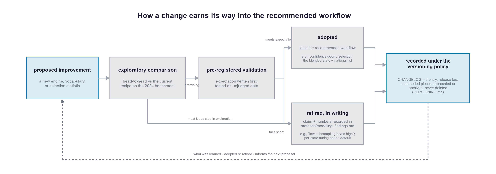

# Versioning and compatibility policy

Agencies build processes on this code, so they need continuity in what they
run and a clear account of what changes and why. This page explains how
improvements roll out, how older versions are kept working, and how changes
are announced.

Methodology changes follow the same discipline: explored head-to-head,
validated on data that never judged them, then adopted or retired in writing.

## What counts as the public interface

Three things are "interface" here — changing any of them incompatibly is a
breaking change:

1. **Script entry points and their config blocks** — the top-level `INCL_*`,
   `EXCL_*`, and runner scripts, and the settings a user edits at the top of
   each (`features`, `TARGET_IS_ERROR`, budgets, floors, and so on).
2. **Output schemas** — the columns and meanings of the CSVs a script writes
   (delivery lists, rule files, sweep results).
3. **File locations of published artifacts** — where rule lists and outputs
   live in the repository.

Everything under `methods/` is **research code**: studies, benchmarks, and
one-off analyses. It may change or be superseded at any time and is not
covered by compatibility promises. Everything under `archive/` is **frozen**:
kept exactly as published, never edited, so results and external references
to it stay reproducible.

## Version numbers and tags

Releases are tagged `vMAJOR.MINOR.PATCH`
([semantic versioning](https://semver.org/), applied to the interfaces above):

- **MAJOR** — something you may depend on breaks: a script's config block
  changes incompatibly, an output column is removed or changes meaning, or a
  published artifact moves. The changelog says exactly what and what to do.
- **MINOR** — new capability or new columns, backward compatible. Your
  existing workflow runs unchanged.
- **PATCH** — fixes and documentation; no behavior you configured changes.

If you need stability, pin a tag: `git clone --branch v2.1.0 ...` (or
download that release from GitHub). The `main` branch carries work in
progress between releases.

## Release cadence and restraint

Version numbers track the user contract, not our research activity. The
`methods/` folder exists so that exploration never disturbs anyone's
workflow; by the same principle, exploration never drives a release —
auditions, sweeps, and retired claims accumulate quietly on `main` and in
the findings file. A release is cut only when the recommended workflow or
its published artifacts change in a way a user would notice, and a MAJOR
release is rare: reserved for breaks that cannot be avoided, deferred to
natural transition points, and bundled with enough new value that moving is
worth it. Renaming things for tidiness alone is not such a reason.

## How changes are communicated

- **[CHANGELOG.md](CHANGELOG.md)** is the single high-level summary, in
  [Keep a Changelog](https://keepachangelog.com/en/1.1.0/) format. Every
  release lists what was Added / Changed / Deprecated / Removed / Fixed, in
  plain language, with migration notes where needed. If you only read one
  file before updating, read this one.
- Method-level results and the evidence behind recommendations live in
  `methods/modeling_findings.md`; design decisions in `methods/design_*.md`.

## How we keep existing workflows working

- **Deprecate before removing.** A superseded script keeps working for at
  least one MINOR release with a two-line header pointing to its successor
  (the same convention the v1 scripts follow today). Removal, if it ever
  happens, is a MAJOR release.
- **Archive, don't delete.** Superseded outputs move to `archive/` with
  references updated; they are never rewritten. The v1 pipeline itself is
  the standing example: it still runs, documented, years after v2 replaced
  it.
- **Additive schema changes.** New output columns are appended; existing
  columns keep their names and meanings. A schema that must change
  incompatibly means a MAJOR release and a side-by-side note in the
  changelog mapping old columns to new.
- **Validated before recommended.** A methodology change is not adopted into
  the recommended workflow until it has passed testing on a year of data it
  never saw (and is retired, in writing, if it fails — see the findings
  file for retired claims).

## For contributors and forks

States are encouraged to adopt, modify, and make this code their own. If you
fork: the pieces designed to be swapped are the `features` vector and
`TARGET_IS_ERROR` expression in each script's config block — the pipeline
does not otherwise assume our column names. If you carry local changes,
pinning a release tag and reviewing CHANGELOG.md before rebasing is the
low-surprise path.
